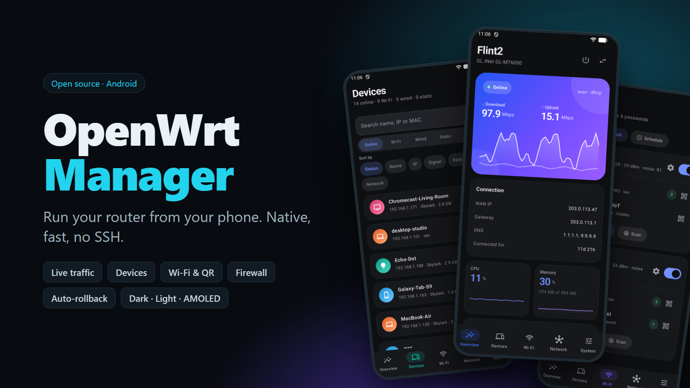
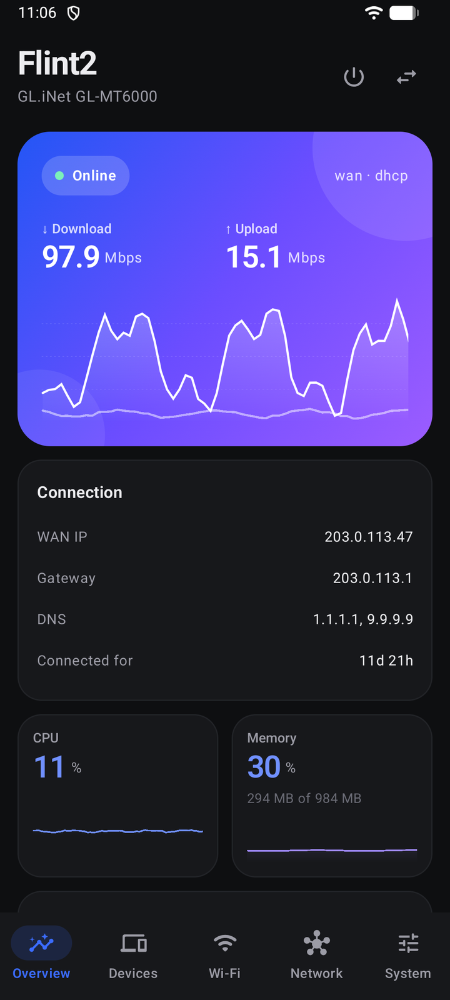
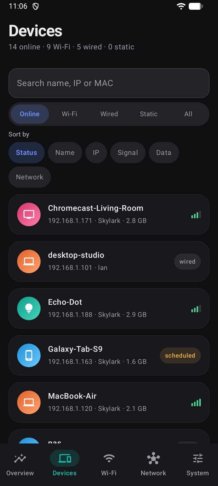
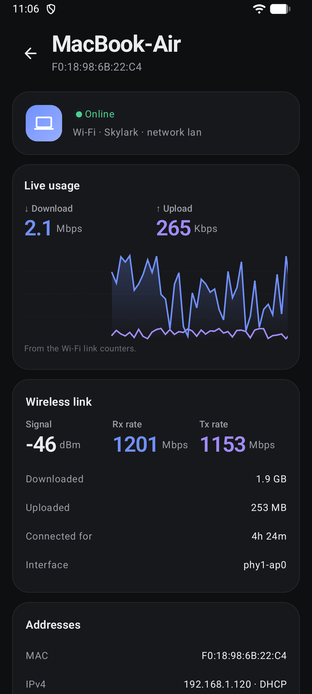
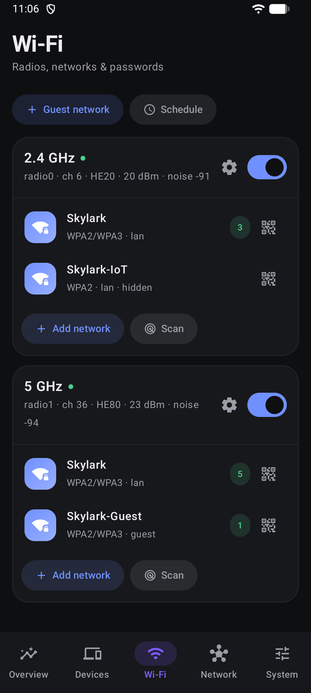
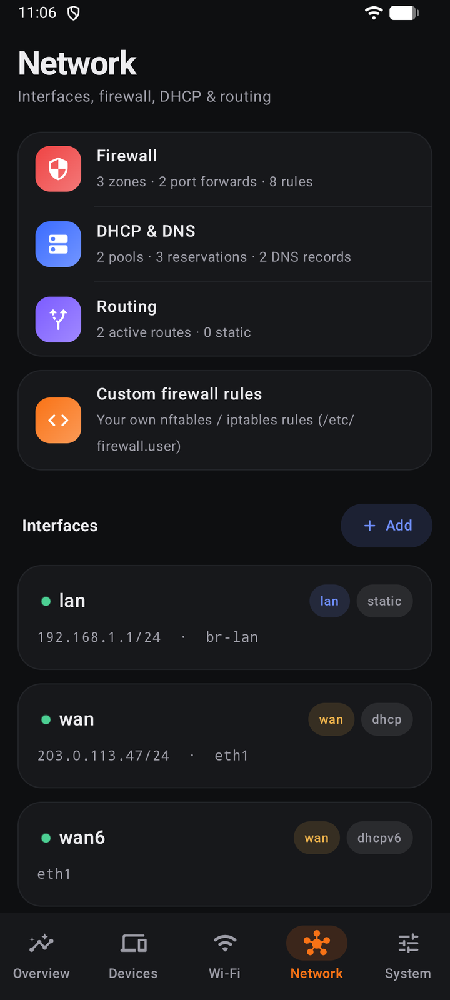
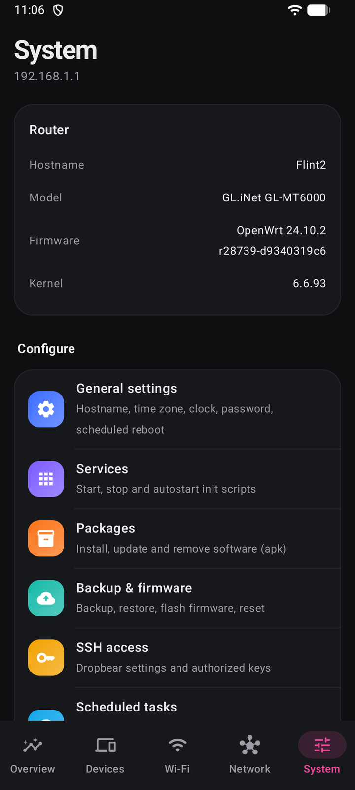
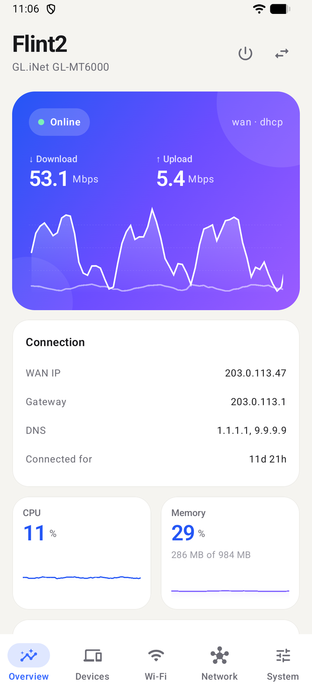
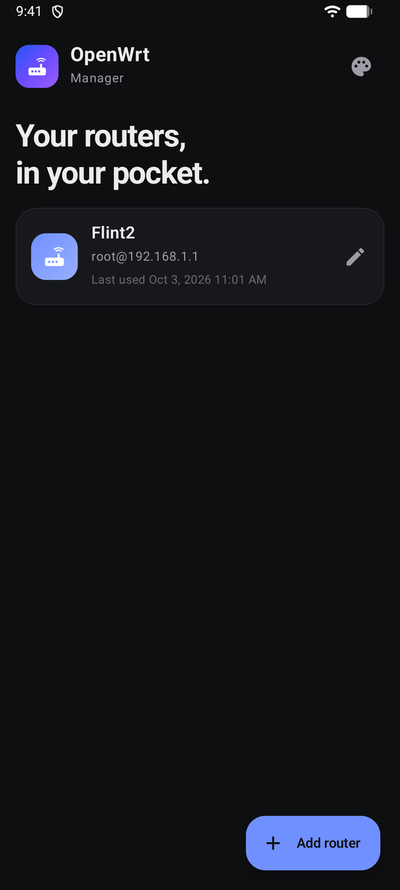

<p align="center"></p>

# OpenWrt Manager

A native Android app for looking after your OpenWrt router from your phone.

It talks to the router the same way LuCI does, over the ubus JSON-RPC interface served by `uhttpd`. There is nothing to install on the router, no SSH, and no web view: you sign in with your normal router login and get a proper mobile interface.

<p align="center">
  
  
  
</p>
<p align="center">
  
  
  
</p>
<p align="center">
  
  
</p>

## What you can do

**Overview.** Live download and upload across all your internet connections combined, CPU and memory, WAN details, Ethernet port status, and Wi-Fi at a glance. Each interface shows its live speed; open one for its own graph, totals and details, and a list of the devices behind it ranked by what they're using right now.

**Devices.** See everyone on the network with their signal, address and data use. Open a device to block its internet, pause it on a schedule, give it a fixed IP and name, forward a port to it, watch its live traffic, see how much data it has used, or wake it up.

**Wi-Fi.** Turn radios on and off, change channels and power, edit or add networks, create a guest network, share a network by QR code, schedule Wi-Fi hours, and scan for nearby networks.

**Network.** Add, edit and delete interfaces. Manage firewall zones, port forwards, traffic rules and your own firewall script. Manage DHCP pools, static leases and local DNS records. View routes.

**System.** Hostname, time zone and clock, password, services, packages, backup and restore, firmware upgrade, SSH keys, startup script, scheduled tasks (cron), router LEDs, and add-on apps such as DDNS, SQM or UPnP when they are installed. For troubleshooting there are the system log, processes, live connections, storage, ping, traceroute and DNS lookup, a raw UCI editor, and a ubus API console.

Changes to network settings are applied with an automatic rollback, so a mistake that cuts the app off from the router reverts itself.

The app has several colour themes, including light, dark and AMOLED, and can follow your phone's setting. Screens slide into place, live numbers roll to their new values, and the traffic graph scrolls smoothly as new readings come in.

## Your router

- OpenWrt with LuCI (or at least `uhttpd` with `uhttpd-mod-ubus` and `rpcd`).
- A login that is allowed to use ubus. The default `root` account works.
- Some features need extra packages on the router and show a clear message if they are missing: `luci-app-wol` for Wake on LAN, and `luci-app-nlbwmon` for per-device data totals that last across reconnects and include wired devices.
- HTTPS is supported. The certificate is pinned the first time you connect, and the app refuses to connect if it later changes.

Your password is stored on the phone only, encrypted with the Android Keystore, and only if you choose to remember it. The app never sends anything anywhere except to the router you add.

## Install

Download the latest APK from the [Releases](../../releases) page. Each release lists a SHA-256 checksum next to the file, and every APK is signed with the same key, so updates install over the top of earlier versions.

Requires Android 8.0 or newer.

## Build it yourself

You need JDK 17 or newer and the Android SDK.

```bash
./gradlew assembleDebug      # debug APK in app/build/outputs/apk/debug
./gradlew testDebugUnitTest  # unit tests
```

Release builds are signed in CI. Without the signing environment, `assembleRelease` produces an unsigned APK, which is what you want for a fork.

## Contributing

Issues and pull requests are welcome. If a change talks to a router, it helps to mention which OpenWrt version and device you tried it on.

## License

MIT. See [LICENSE](LICENSE).
